早在6年前，我的高中同学搭建了自己的 WeChat Bot，其实当时这个坑在我心中已经埋下，但那时的 bot 功能也仅限于自动回复设定好的话术、简单脚本等。

而如今 LLM 的兴起彻底刷新了 Chat Bot 的能力上限，很多人甚至无法区分这些 Bot 是否为真人。再加上如 AstrBot 等 Chat Bot 开发框架和生态社区逐渐成熟，制作一只 Chat Bot 不仅易上手，还能让你的 “虚拟群友” 集成很多有意思的小功能。

借用 AstrBot 开发者的一句话：“**陪伴与能力从来不应该是对立面。我们希望创造的是一个既能理解情绪、给予陪伴，也能可靠完成工作的机器人——致敬[ATRI](https://zh.wikipedia.org/zh-cn/ATRI_-My_Dear_Moments-)。**”
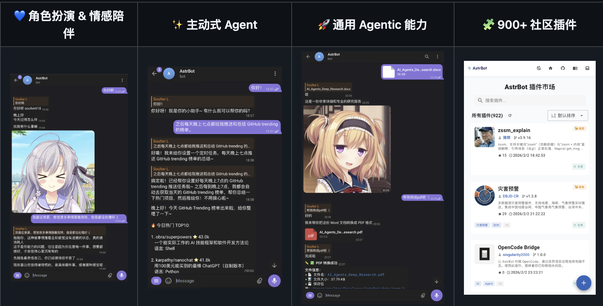
# 准备工作
在开始之前，你需要具备以下条件：
- 一台 Linux 服务器
- 一个 QQ 新号，因为搭载 QQ Bot 后可能会:spoiler[被腾讯的大手做局而]被封号
- 信息搜索能力。如果遇到本教程无法解决的问题，请前往[AstrBot 官网使用手册](https://docs.astrbot.app/what-is-astrbot.html)查看。

# 部署 AstrBot
安装 docker 环境，并设置开机自启
```bash
curl -fsSL https://get.docker.com -o get-docker.sh
sudo sh get-docker.sh
sudo systemctl start docker
sudo systemctl enable docker
```
执行下面的命令以检验是否安装成功
```bash
docker --version
```
通过 Docker 部署 AstrBot
```bash
mkdir astrbot
cd astrbot
sudo docker run -itd -p 6185:6185 -p 6199:6199 -v $PWD/data:/AstrBot/data -v /etc/localtime:/etc/localtime:ro -v /etc/timezone:/etc/timezone:ro --name astrbot m.daocloud.io/docker.io/soulter/astrbot:latest
```
执行下面语句，如果一切顺利，你会看到 AstrBot 打印出的日志。
```bash
sudo docker logs -f astrbot
```
检查是否日志显示以下信息，打开`http://(你的云服务器ip):6185`即可访问 AstrBot 管理面板
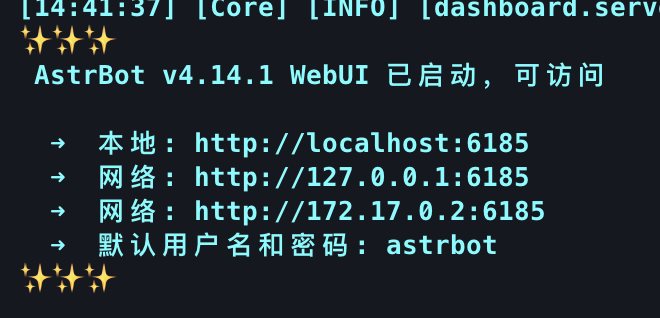
:::tip
默认用户名和密码是 `astrbot` 和 `astrbot`。
:::
放行服务器对应端口（6185）。
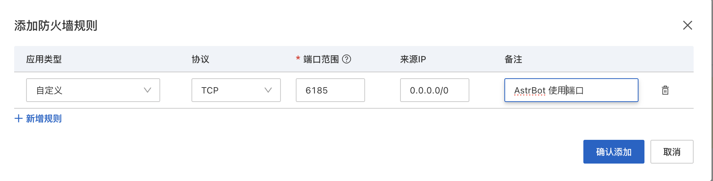
# 接入到消息平台
Docker 部署 NapCat
```bash
curl -o napcat.sh https://nclatest.znin.net/NapNeko/NapCat-Installer/main/script/install.sh && \
sudo bash napcat.sh --docker y --qq "(你自己QQBot的QQ号)" --mode ws --proxy 1 --confirm
```
执行下面语句，如果一切顺利，你会看到 NapCat 打印出的日志。
```bash
sudo docker logs napcat
```
用你的手机登录 QQBot 的 QQ，扫描日志中生成的登录二维码（扫码操作也可以在下一步中，打开Napcat WebUI 链接做）
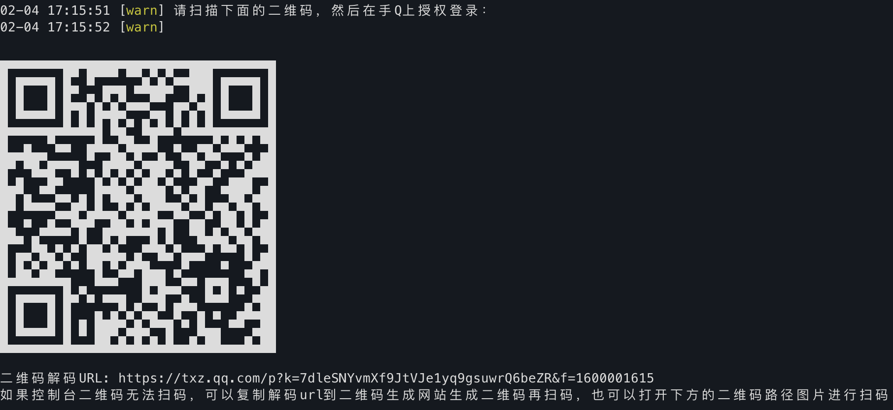
放行服务器对应端口 6099 和 3001。

日志中可以找到 Napcat WebUI 的链接。在浏览器中将 `127.0.0.1` 替换为你的服务器公网 ip 即可访问，即`http://(你的服务器ip):6099/webui/?token=(你的token)`
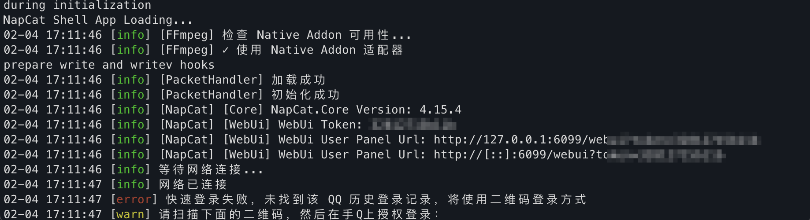

# 配置  AstrBot
## 在 AstrBot 配置 aiocqhttp
在浏览器输入`http://(你的服务器 ip):6185/#/`，进入 AstrBot 的管理面板。在左边栏 `机器人`中点击`+ 创建机器人`
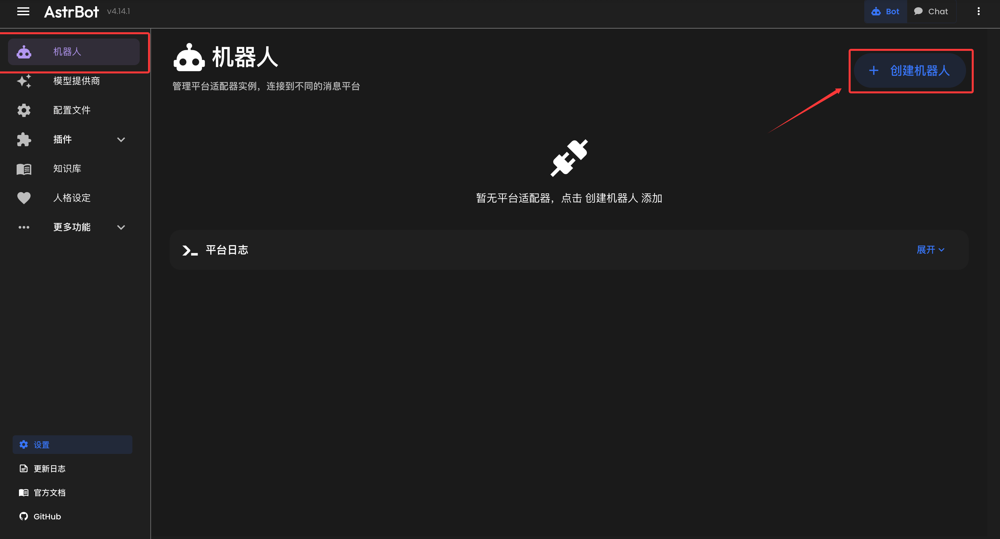
之后弹出的表单填写：
- **消息平台类别**：OneBot v11
- **机器人名称**：不重要，仅用于区分不同的消息平台实例
- **启用**：点击开启
- **反向 Websocket 主机**：默认的`0.0.0.0`
- **反向 Websocket 端口**：默认的`6199`
- **反向 Websocket Token**：不填写
- **配置文件**：按默认的不动
点击保存

放行服务器对应端口 6199
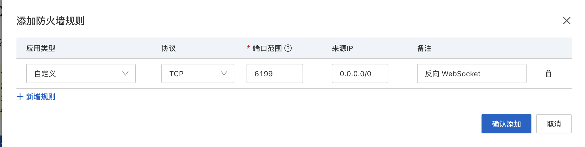
## 配置管理员
t进入 `配置文件` 页，点击 `平台配置` 选项卡，找到 `管理员 ID`，填写你的 QQ 账号 ID（不是机器人的账号 ID）。
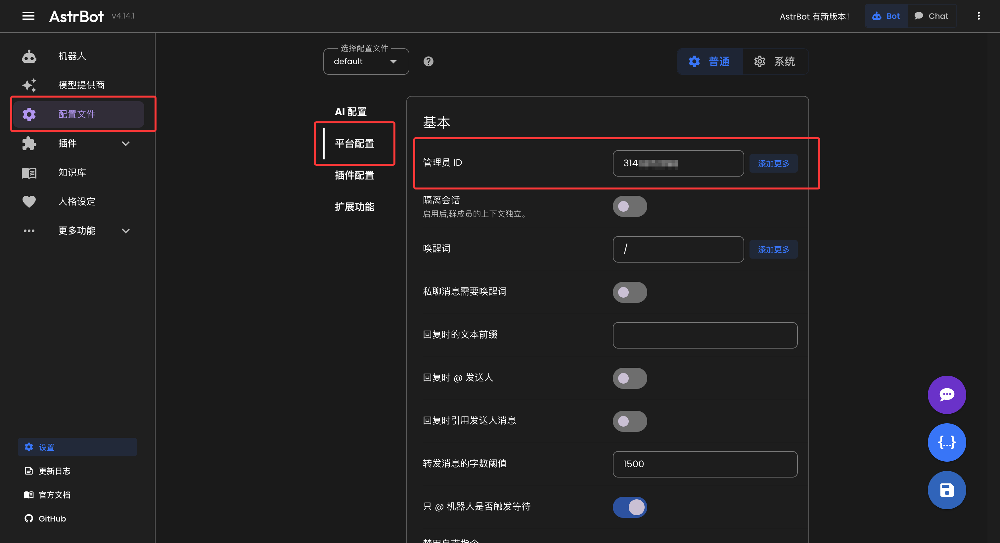
切记点击右下角 `保存`，AstrBot 重启并会应用配置。
## 在 NapCat 中添加 WebSocket 客户端
切换回 NapCat 的管理面板，点击 `网络配置->新建->WebSockets客户端`。
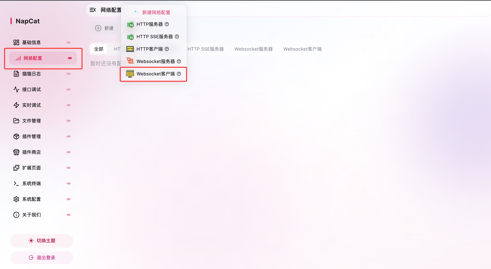
之后弹出的表单填写：
- **启用**：打开
- 名称：不重要，随意填写
- **URL**：`ws://你的服务器公网IP:6199/ws`
- **消息格式**：Array
- **Token**：清空
- **心跳间隔**：5000
- **重连间隔**：5000
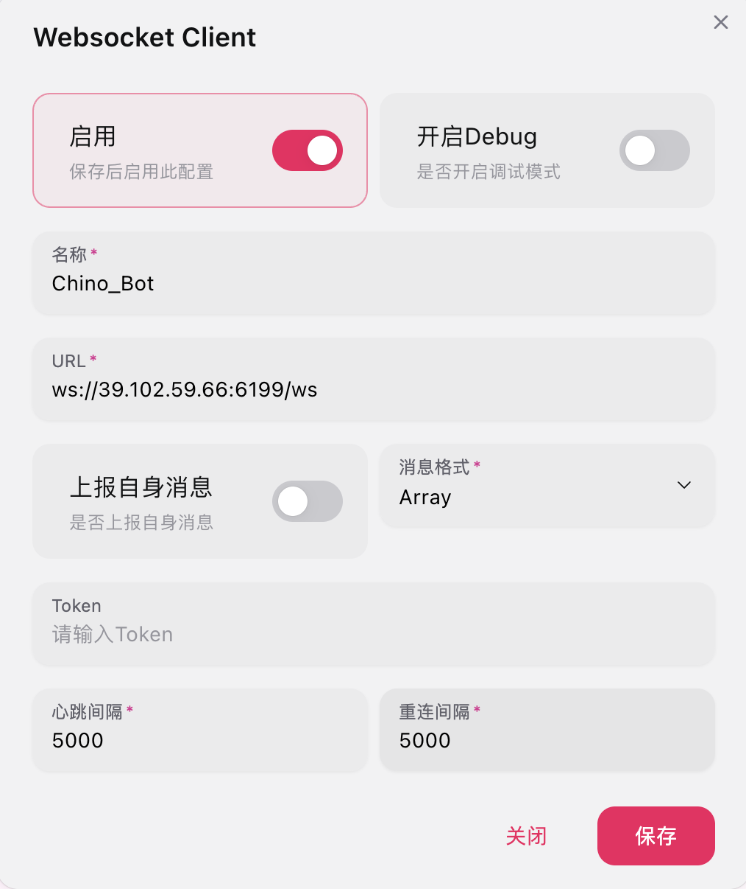
:::important
切记 URL 后面加一个 `/ws`

如果你 AstrBot 的 `反向 Websocket Token` 是空的，务必清空 Token 值
:::
前往 AstrBot WebUI 控制台，点击机器人，打开平台日志。如果日志中显示`aiocqhttp(OneBot v11) 适配器已连接` 的蓝色字样，说明连接成功！如果没有，若干秒后出现 `aiocqhttp 适配器已被关闭` 则为连接超时（失败），请检查配置是否正确。
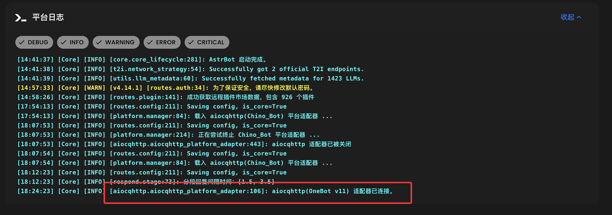
至此，你的 AstrBot 和 NapCat 应该已经连接成功！使用 `私聊` 的方式对机器人发送 `/help` 以检查是否连接成功。

当前，现在我们只是单纯的打通 NapCatQQ 协议端与 AstrBot 逻辑端，Kyy008 现在也在研究如何让 Bot 集成好玩的功能，这些进阶内容我们放在下一篇文章讲。