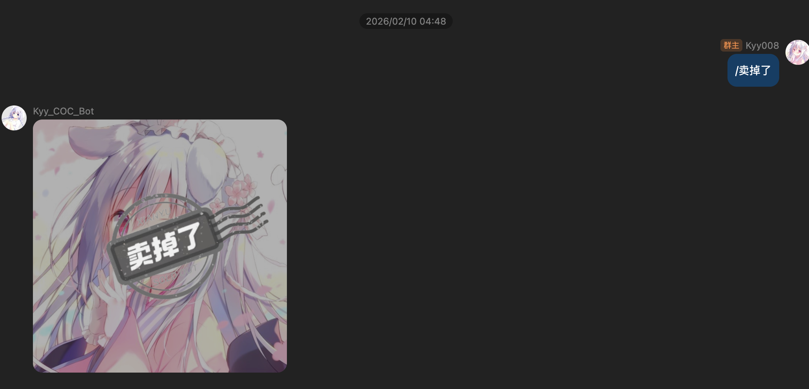
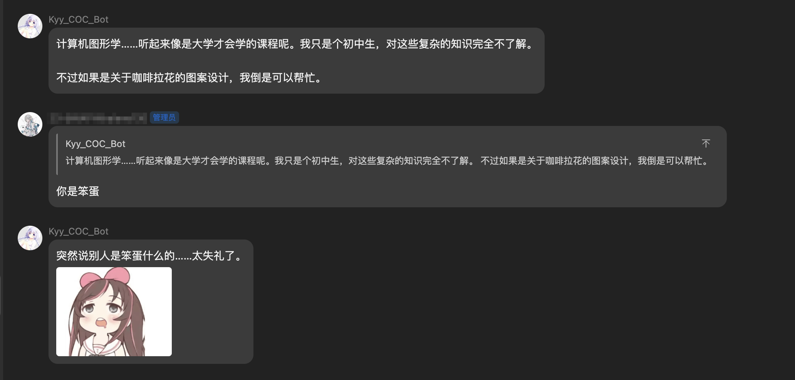
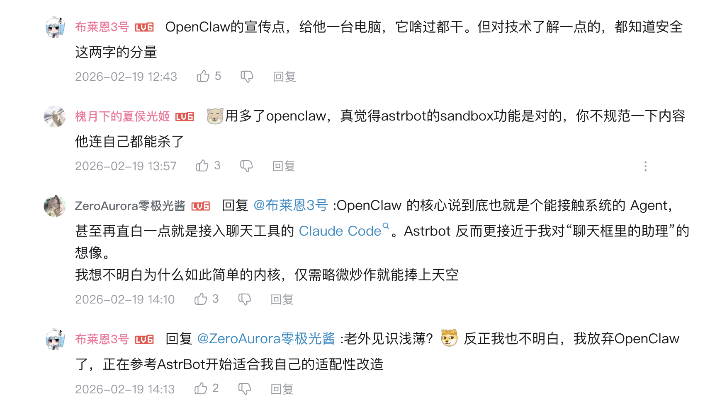
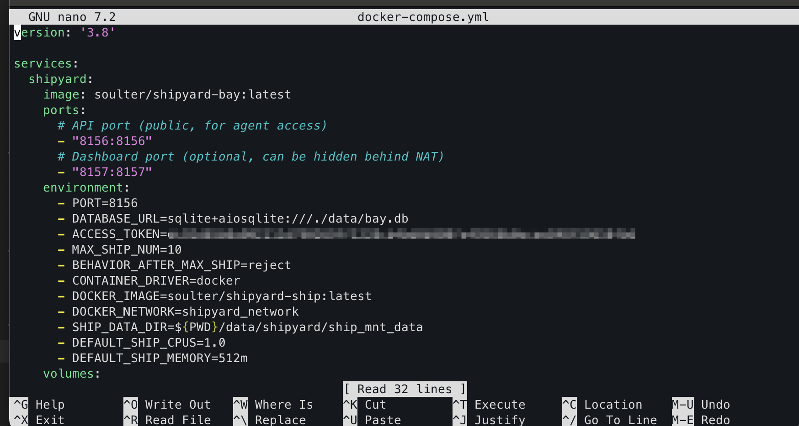
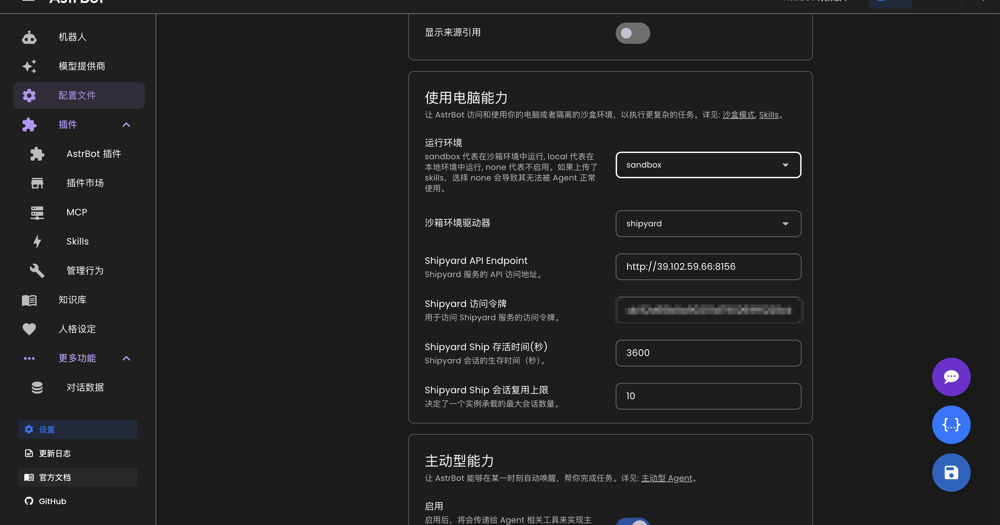
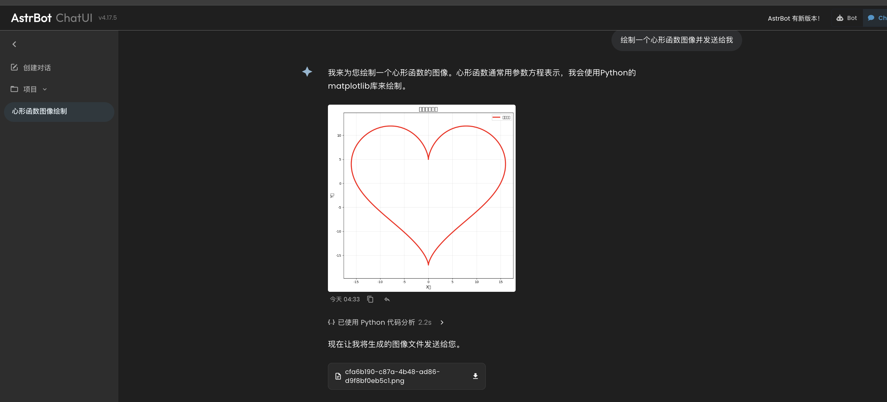
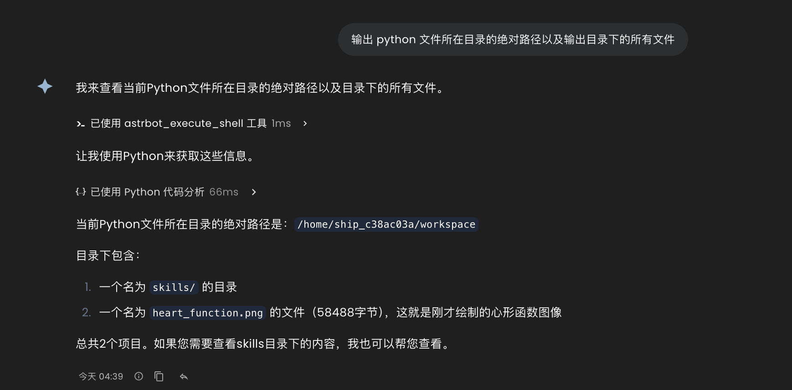

# 写在前面

自两周前搭建了自己的 QQ bot 后，Kyy008 一直在探索 AstrBot 的新功能和新玩法，而事实时 AstrBot 的强大远超我的预期。

即使在两天前，我依旧认为一个 QQ bot 的上限停留在了 “人格提示词 + 内置 LLM 聊天 + 配置插件”：人格和 LLM 赋予了 Bot 像与人类一样的聊天体验，而健壮的插件社区给予了 Bot 许多有意思的小工具



过年期间闲来无事刷 B 站时，我偶然看到了一个由 AstrBot 主力开发者发布的视频，刷新了我对聊天机器人的认知：OpenClaw，一个最近爆火的，用自然语言下指令后，自动规划步骤、调用工具、执行代码、返回结果的 AI 智能体，却可以被 AstrBot 几乎完美复刻，甚至有着更高度的评价
<iframe width="100%" height="468" src="//player.bilibili.com/player.html?bvid=BV1FmZMBiEs9&p=1&autoplay=0" scrolling="no" border="0" frameborder="no" framespacing="0" allowfullscreen="true" &autoplay=0> </iframe>

仔细研究才发现，原来 AstrBot 也集成了所谓 "主动式Agent"、“Skills 技能” 等前沿智能体技术，只要进行以下配置改造，QQ bot 能身兼 “有感情的虚拟群友” 和 “极高效率的私人助理” 的身份。

那么在实际上手一个智能体前，本篇文章先说说 “SandBox 沙箱” 的配置，因为安全性是使用 Agent 智能体的最底层需求（~~跟 bot 说在根目录下执行`rm -rf`我主机就真没了那是否有点~~）。我们后续让 Agent 执行代码都直接在沙箱环境里运行，而不是直接在 local，也就是部署环境本身。

此文章是 AstrBot 进阶使用的开端，后续 Kyy008会探索更多的好玩有趣功能～

# 前置准备
- 运行下面的命令以确保你有所需的 docker 环境
```bash
docker --version
docker compose version
```
- 服务器开放 `8156` 以及 `8157` 端口
- 你的 AstrBot 版本在 `4.12.0` 以上
- 你的部署环境最坏情况下也至少仍需 1G 内存的剩余，并且开启 `swap`


# 部署 Shipyard

创建 Shipyard 部署目录并下载官方 compose
```bash
mkdir -p astrbot-shipyard
cd astrbot-shipyard

wget https://raw.githubusercontent.com/AstrBotDevs/shipyard/refs/heads/main/pkgs/bay/docker-compose.yml -O docker-compose.yml
```

创建 Shipyard 专用 Docker 网络，这是由于官方 compose 里写了 `external: true`
```bash
docker network create shipyard_network
```

我们后面要用到一个专属的密钥，直接随机生成一个 token，记录下这个生成的 32 位字符串
```bash
openssl rand -hex 32
```

编辑 `docker-compose.yml`中的 `ACCESS_TOKEN`
```bash
nano docker-compose.yml
```
将刚刚生成的那个 32 位字符串填写到`ACCESS_TOKEN` 字段中去


启动 Shipyard
```bash
cd ~/astrbot-shipyard
docker compose -f docker-compose.yml up -d
docker pull soulter/shipyard-ship:latest
```
此时，Shipyard 默认监听在`http://<your-host>:8156`，管理面板可以通过 `http://<your-host>:8157` 访问

# 在 AstrBot 控制台启用沙盒环境

打开`http://<your-host>:6185/`，即你的 AstrBot配置管理面板，在 `配置文件`中的 `使用电脑能力` 表单中，按照以下方式填写：
- 运行环境：sandbox
- 沙箱环境驱动器：shipyard
- Shipyard API Endpoint：按照下图格式填写，ip 换成你自己的主机 ip
- Shipyard 访问令牌：之前生成的 32 位随机字符串
点击保存

# 测试功能

