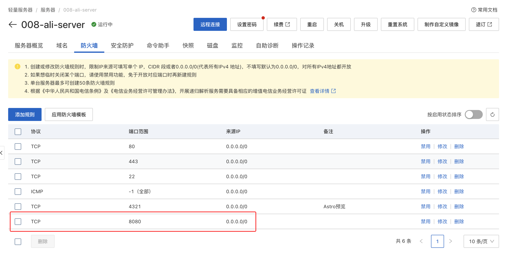
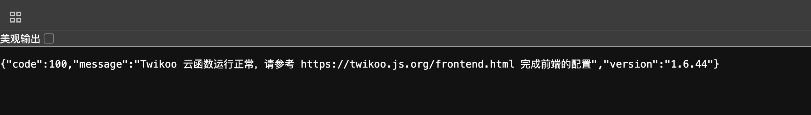
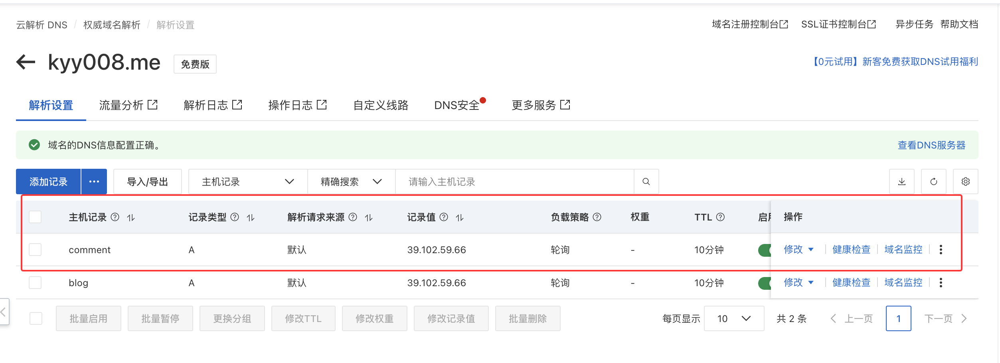
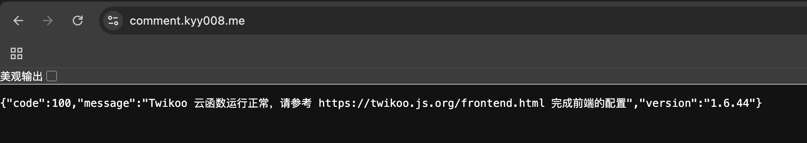
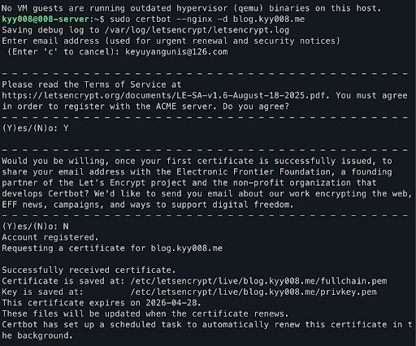
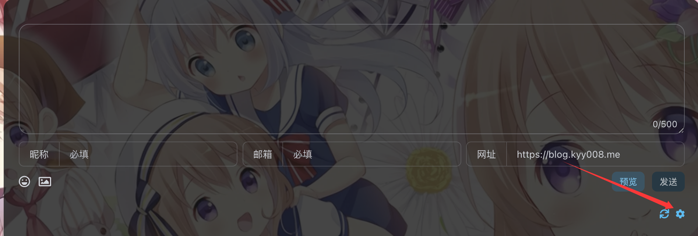
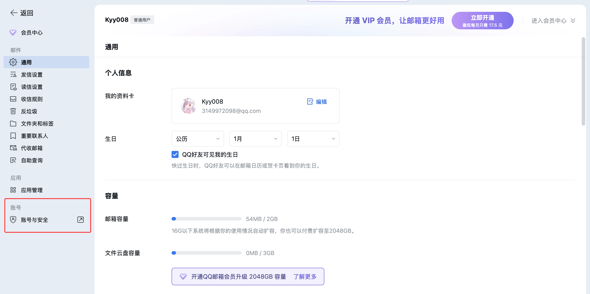
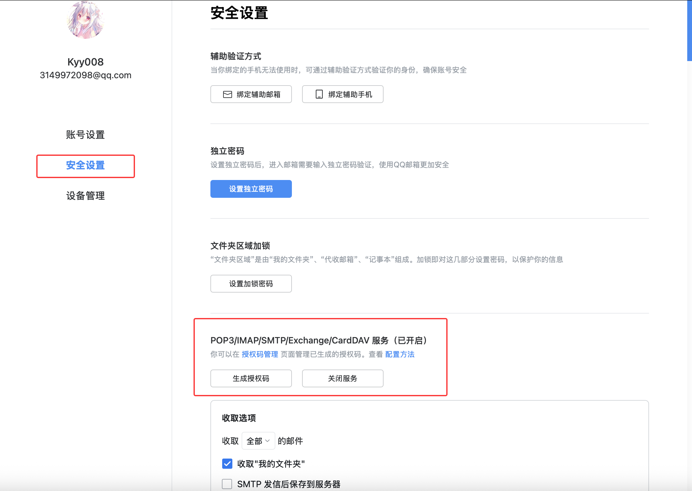
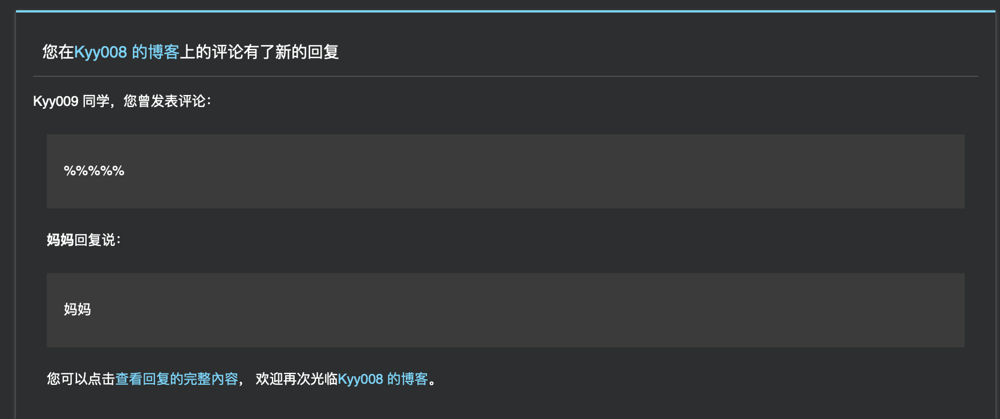

上一篇文章我们讲过如何在静态博客记录用户的浏览量数据，那我们能不能在静态网站实现一个评论区系统呢？当然可以，而且并不麻烦。
# 前提
开始之前，请确保：
- 你拥有一个公网 IP 的 Ubuntu 服务器
- 有一个解析到该服务器 IP 的域名
- :spoiler[你的电脑本地具备科学上网的能力]
- 你的电脑本地配置好了 Docker 环境，你可以在终端输入`docker -v`检验

为什么呢？因为国内服务器是的网络环境是大概率无法连接到 Docker Hub 官方仓库的，执行`docker-compose up`会返回导致网络连接超时错误，而在服务器上配置代理又比较麻烦，那我们不妨采用 “本地拉取、上传服务器、离线加载“的模式。

# 服务器环境准备

使用 Docker 和 Docker Compose 来运行 Twikoo 服务端。这种方式便于管理和升级，且数据易于备份。

:::tip
以下操作均在你的云服务器上执行，这里省略登录服务器的过程
:::

更新软件源
```bash
sudo apt update
```
安装 Docker
```bash
sudo apt install docker.io -y
```
安装 Docker Compose
```bash
sudo apt install docker-compose -y
```
启动 Docker 并设置开机自启
```bash
sudo systemctl start docker
sudo systemctl enable docker
```
在服务器上创建一个目录用于存放 Twikoo 的配置和数据
```bash
mkdir -p ~/twikoo
cd ~/twikoo
```

# 拉取 Twikoo Docker 镜像
:::tip
以下操作均在本地执行
:::

拉取镜像
```bash
docker pull --platform linux/amd64 imaegoo/twikoo
```
打包成文件
```bash
docker save -o twikoo_amd64.tar imaegoo/twikoo
```
上传到你的服务器 ，**这里请务必替换成你的用户名和ip**
```bash
scp twikoo_amd64.tar kyy008@39.102.59.66:~
```

# 服务器加载与配置
:::tip
回到服务器终端继续操作
:::

加载刚刚上传的镜像包，看到 `Loaded image: imaegoo/twikoo:latest` 即表示成功。
```bash
sudo docker load -i ~/twikoo_amd64.tar
```
为了防止出现 `EACCES: permission denied` 导致的无限重启，我们预先建立数据目录并放开权限：
```bash
cd ~/twikoo

mkdir data

sudo chmod -R 777 data
```
创建并编辑`docker-compose.yml`：
```bash
nano docker-compose.yml
```
写入以下内容：
```yaml
version: '3'
services:
  twikoo:
    image: imaegoo/twikoo
    container_name: twikoo
    restart: always
    pull_policy: never 
    ports:
      - 8080:8080
    environment:
      - TWIKOO_THROTTLE=1000 
    volumes:
      - ./data:/app/data
```
`Ctrl+O` 回车保存, `Ctrl+X` 退出

启动服务，输出`Creating twikoo ... done`表示成功
```bash
sudo docker-compose up -d
```
验证一下
```bash
sudo docker ps
```
如果 `STATUS` 显示 `Up x seconds/hours`表示正常， `STATUS` 显示`Restarting` 或 `Exited`表示仍然有些问题，请检查之前的操作是否正确

接下来请确保你的服务器防火墙放行了`8080` 端口。以阿里云为例，添加入站规则：TCP `8080`，允许所有 IP (`0.0.0.0/0`) 访问。

现在如果你在浏览器输入`(你的服务器ip):8080` ，看到 Twikoo 的初始化配置界面，即代表部署任务完成


# 域名解析配置 

我们需要先将一个子域名（例如 `comment.kyy008.me`）解析到你的服务器 IP，这样才能通过域名访问你的评论服务。这里以阿里云为例。

点击 **添加记录**，填写如下信息：
- 记录类型：`A` 
- 主机记录：`comment`
- 记录值：你的服务器公网 IP



# 配置 Nginx 反向代理


安装 Nginx :spoiler[真的没有安装过吗 (]
  
```bash
sudo apt install nginx -y
```
创建一个新的 Nginx 配置文件：
```bash
sudo nano /etc/nginx/sites-available/twikoo
```
写入以下内容，注意 `server_name` 字段务必替换成你的域名。
```nginx
server {
    listen 80;
    server_name comment.kyy008.me; # 替换为你的域名

    location / {
        proxy_pass http://127.0.0.1:8080; 
        proxy_set_header Host $host;
        proxy_set_header X-Real-IP $remote_addr;
        proxy_set_header X-Forwarded-For $proxy_add_x_forwarded_for;
        proxy_set_header REMOTE-HOST $remote_addr;
        
        proxy_http_version 1.1;
        proxy_set_header Upgrade $http_upgrade;
        proxy_set_header Connection "upgrade";
    }
}
```
启用该配置：
```bash
sudo ln -s /etc/nginx/sites-available/twikoo /etc/nginx/sites-enabled/
sudo nginx -t 
sudo systemctl reload nginx
```
此时，你应该可以通过 `http://comment.(你的域名)` 访问到 Twikoo 服务了。

# 配置 HTTPS
为了安全以及满足现代浏览器对 Mixed Content 的限制，即HTTPS 网站必须加载 HTTPS 资源，我们需要为 Twikoo 配置 HTTPS。

我们使用一个免费的开源工具 **Certbot**，可以自动从 Let's Encrypt 证书颁发机构申请 SSL 证书。通过验证你对域名的控制权，成功后自动下载证书并修改 Nginx 配置，从而让你的网站实现 HTTPS 加密访问。

安装 NginxCertbot 及其 Nginx 插件：
```bash
sudo apt install certbot python3-certbot-nginx -y
```
运行 Certbot 自动配置 SSL，注意替换成你的域名：
```bash
sudo certbot --nginx -d comment.kyy008.me
```
如果你第一次运行，可能要填写邮箱、同意条款等。我们同意服务条款并拒绝邮件订阅

完成后，你的 Twikoo 后端地址即为：`https://comment.(你的域名)`。

# 项目配置

现在后端已经就绪，我们需要在博客项目中启用 Twikoo。以下操作都是基于本博客项目的配置，项目的仓库源码：
::github{repo="Kyy008/008-blog"}

打开项目中的 `src/config.ts` 文件，找到 `commentConfig` 部分，将其修改为如下内容：
```typescript
export const commentConfig: CommentConfig = {
	enable: true, 
	twikoo: {
		envId: "https://comment.yourdomain.com", 
		lang: SITE_LANG,
	},
};
```
此时就可以在文章底部看到评论框了～

# 配置邮件提醒
我们可以在评论区右下角看到一个设置图标，我们现在这里注册一个管理员账号

可以看到可以配置的选项有很多，不过建议先配置好邮件提醒，这样访客回复你的评论，或者你回复访客的评论，双方都能通过邮件收到提醒。

下面以 **QQ邮箱** 为例
- `SENDER_EMAIL`：填写自己的邮箱账号即可
- `SENDER_NAME`：邮件通知标题，例如 “Kyy008的博客评论提醒”
- `SMTP_HOST`：留空
- `SMTP_SECURE`：留空
- `SMTP_SERVICE`：留空
- `SMTP_USER`：与`SENDER_EMAIL`保持一致
- `SMTP_PASS`：QQ 邮箱的授权码
- `MAIL_SUBJECT`：通知邮件主题，例如 “您在 Kyy008 的博客收到了评论回复”
- `MAIL_TEMPLATE`：留空
- `MAIL_SUBJECT_ADMIN`：博主通知邮件主题，例如 “Kyy008 的博客有新的评论了”
- `MAIL_TEMPLATE_ADMIN`：留空

:::important
`SMTP_PASS`是 QQ 邮箱的授权码而不是登录密码。
:::
如何获取QQ 邮箱的授权码呢？

首先访问[QQ邮箱官网](https://wx.mail.qq.com)并登录。

点击顶部的 **设置**，进入 **账号与安全** 选项卡。

点击 **安全设置** 后，开启 **POP3/IMAP/SMTP/Exchange/CardDAV 服务**，点击 **生成授权码** 。复制这串字符，填入 Twikoo 配置中的 `SMTP_PASS` 字段即可。

配置好后我们就能第一时间收到回复了～

Enjoy it！
