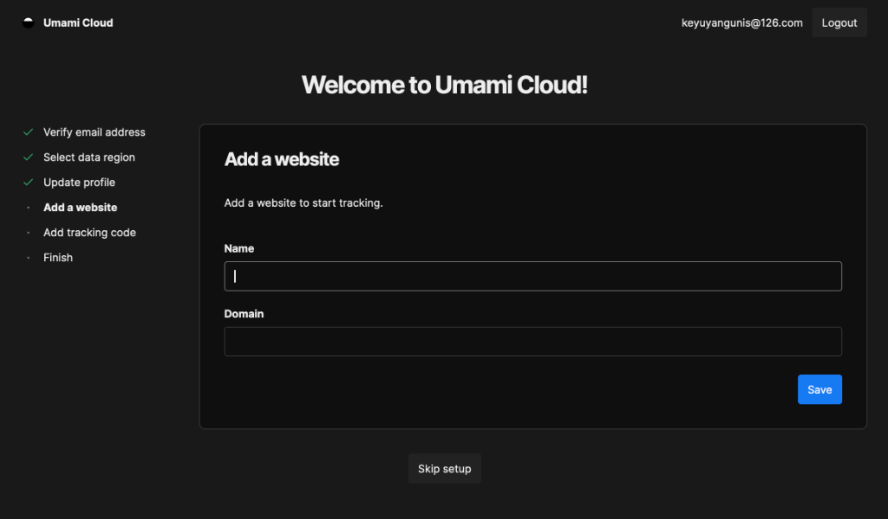
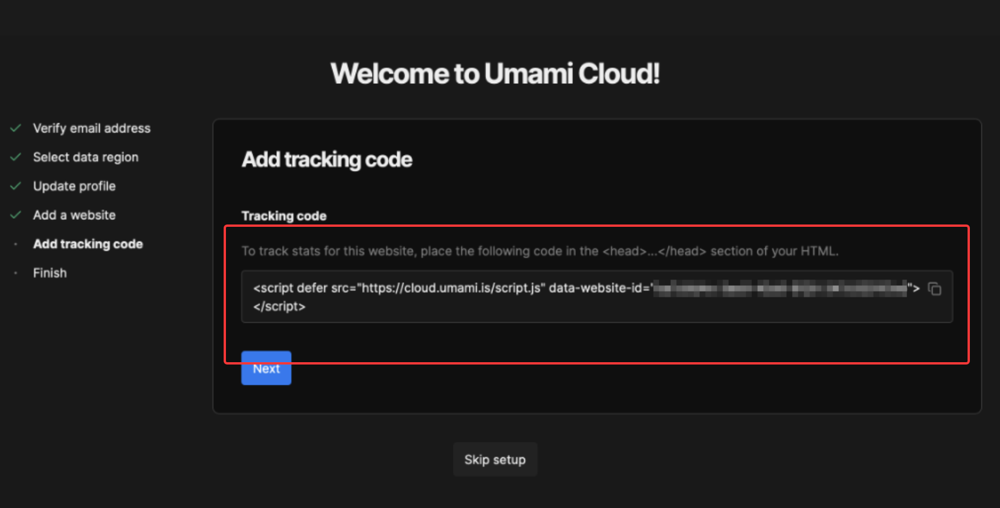
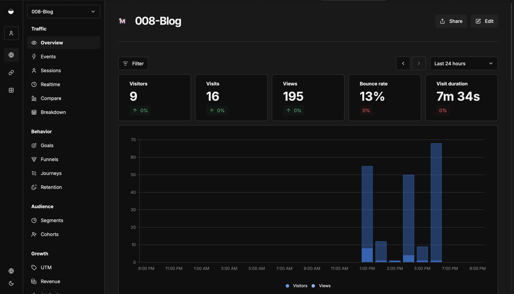
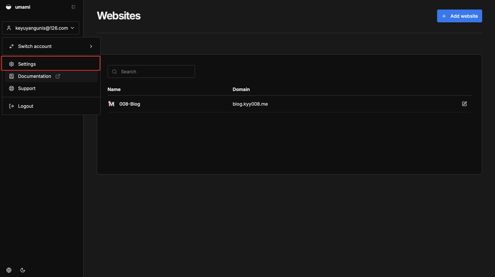
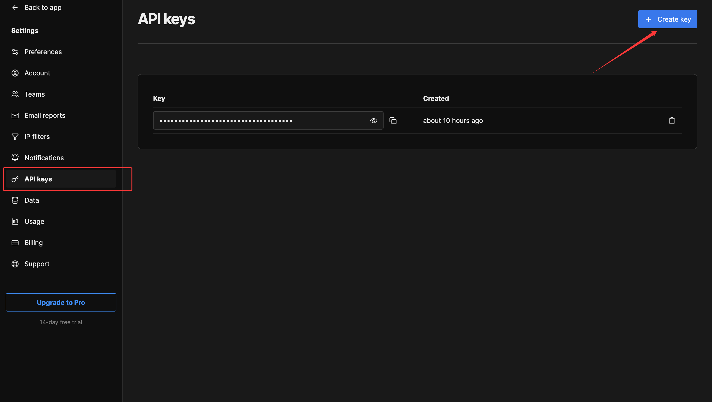

我们知道如 Astro 这样的现代静态站点生成器，生成的博客通常由纯静态的 HTML、CSS 和 JavaScript 文件组成。由于没有传统的后端服务和数据库支持，我们无法直接在服务器端记录用户的访问数据。那我们如何了解博客有多少人访问、每篇文章的访问量又是多少呢？

其实非常简单，我们会使用 **Umami** —— 一个开源、注重隐私且轻量级的网站分析替代方案，来为 Astro 静态博客添加实时的浏览量和访客统计功能。

# 进入Umani
点击进入 [Umani 官网](https://umami.is)，我们先注册一个账号。

验证并填写一些个人信息后，在`Add a website`栏的 "Name" 字段填写你的博客名称（这个可以随意填写，给自己看的），在 "Domin" 字段填写你的博客域名（**不要 带 https:// 或末尾的 /**，例如blog.kyy008.me）

进入`Add tracking code`栏后，记录好 "Tracking code" 的值，之后会用到

我们点击下一步，Umami 的注册工作就完成了。

# 注入Tracking Code

接下来我们需要**将 Tracking Code 部署到你的网站**，这样 Umami 才能接收到网站的数据。

### 纯 HTML 网站
如果你的网站是由 HTML 文件构成的，你需要将刚才复制的 `<script>` 标签粘贴到每个页面的 `<head>` 标签内。

```html
<!DOCTYPE html>
<html lang="zh-CN">
<head>
    <meta charset="UTF-8">
    <title> exanple website </title>
    
    <!-- 在此插入 Tracking Code -->
    <script defer src="https://cloud.umami.is/script.js" data-website-id="xxxx"></script>
</head>
<body>
    ...
</body>
</html>
```

### 使用框架或静态生成器
如果你使用 Hugo, Hexo, Astro 等工具，通常只需要在全局的布局文件（Layout）或主题配置文件中的 `<head>` 区域添加一次即可。这样所有生成的页面都会自动包含这段统计代码。

### 以本博客为例
如果你使用的是本博客的源码，我们已经为你封装好了配置，原理也是一样的，只是通过代码将脚本注入到 Layout 中，但你只需要修改配置文件即可。

打开 `src/config.ts` 文件，找到 `umamiConfig` 配置项：

```typescript
export const umamiConfig = {
  enabled: true, // 开启统计
  // ... 其他配置
  scripts: `
    <!-- 在这里粘贴你的 Tracking Code -->
    <script defer src="https://cloud.umami.is/script.js" data-website-id="你的-website-id"></script>
  `.trim(),
}
```

保存后，系统会自动读取这个配置，并将其插入到所有页面的头部。

配置完成后，就可以进入主页，看到自己的网站的流量情况了


# 调用 API
现在我们只能在后台看到数据。但是我们还希望能在博客页面上显示这些数据展示给用户，怎么办呢？此时就需要使用 Umami 的 API 。

我们要创建一个 **API Key**，并将其配置到博客中。

首先我们回到主页。点击左上角的 “setting” 选项

接着点击 "API keys" 选项后，点击 “Create key”按钮，可以看到系统自动生成了一个 API key，点击复制按钮保存它。



### 一般情况
如果你是自己开发的网站，你需要编写 JavaScript 代码来调用 Umami API。
你需要向 `/api/websites/{website-id}/stats` 发送 GET 请求，并在 Header 中带上 `x-umami-api-key`。

示例代码：
```javascript
const websiteId = '你的-website-id'; 
const apiKey = '你的-api-key';       

fetch(`https://api.umami.is/v1/websites/${websiteId}/stats`, {
  headers: {
    'x-umami-api-key': apiKey
  }
})
.then(res => res.json())
.then(data => {
  console.log('总访问量:', data.pageviews);
  console.log('总访客数:', data.visitors);
 
});
```

### 以本博客为例
如果你使用的是本博客的源码，过程会简单很多。我们已经封装好了调用逻辑，你只需要在配置文件中填入 API Key 即可。

打开 `src/config.ts`，再次找到 `umamiConfig`：

```typescript
export const umamiConfig = {
  enabled: true,

  apiKey: "api_xxxxxx...", 
  baseUrl: "https://api.umami.is",
  scripts: `...`
}
```

保存文件并重新部署博客。现在就可以实现与本博客相同效果的实时访问量和访客统计了！
:::tip
浏览量记录为任意用户只要访问了则计数一次。而访问数记录不会记录单IP多次重复访问和同一时间段的多次请求不同页面
:::
