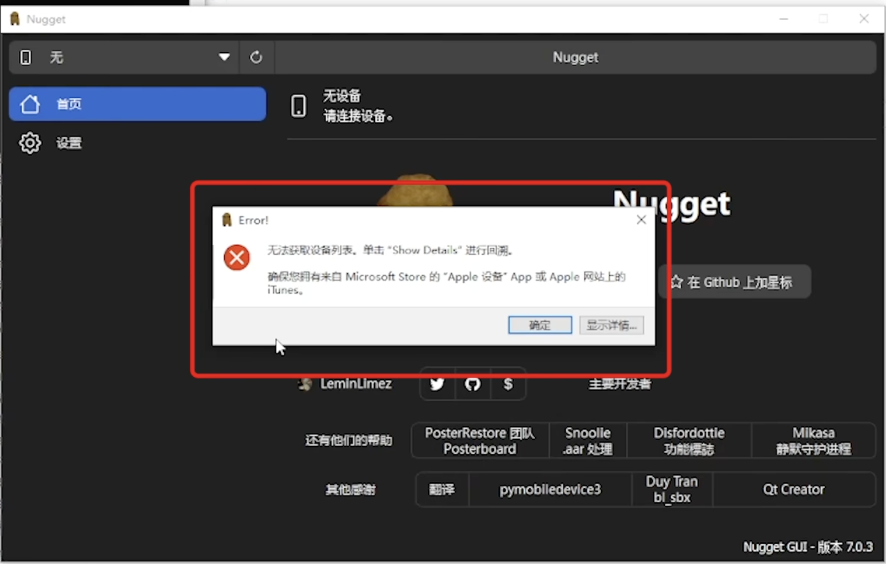
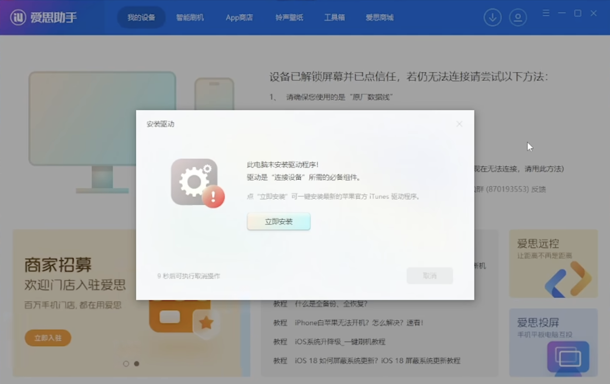
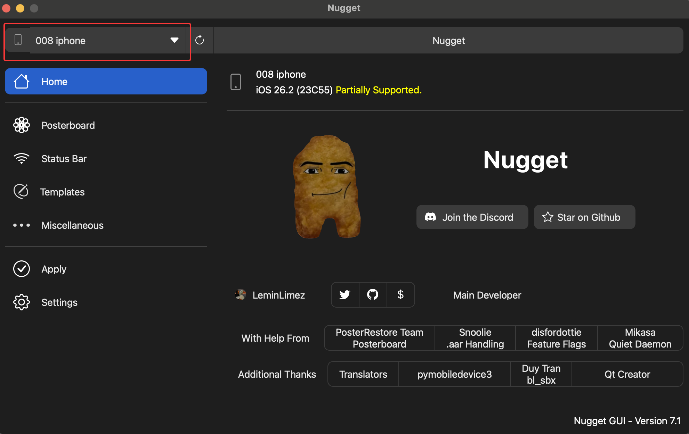
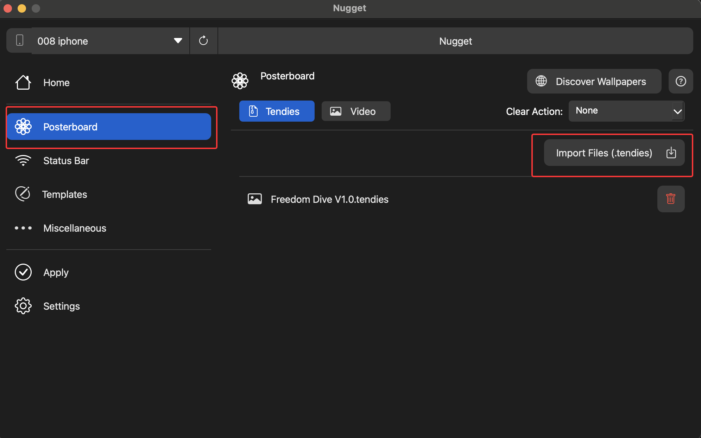
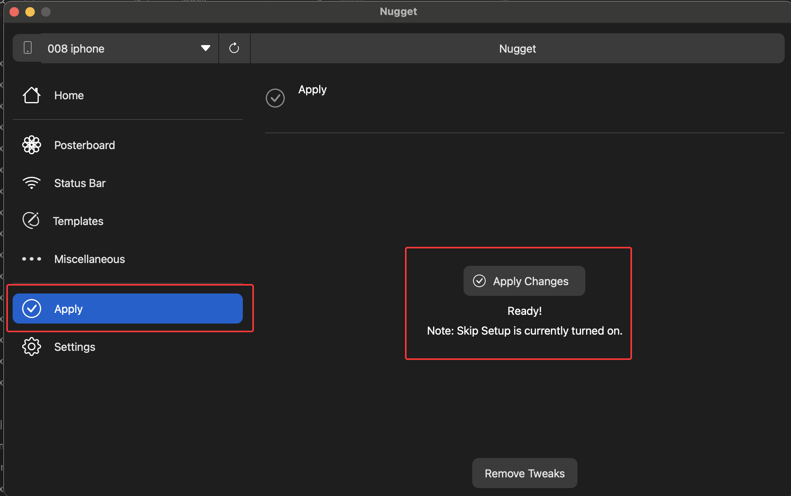
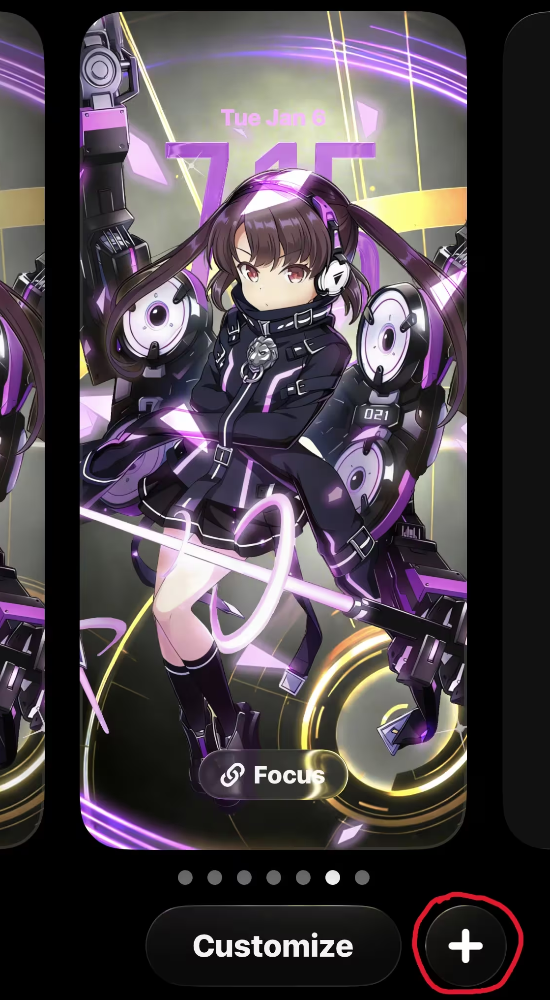
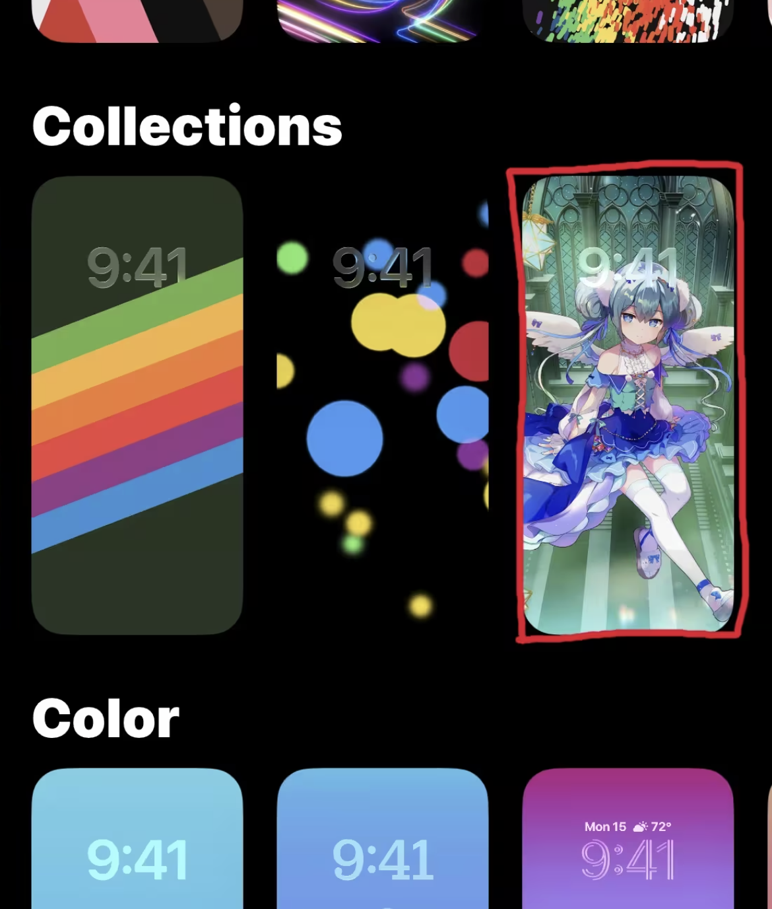

~~iOS遥遥领先~~

具体效果演示：
<iframe width="100%" height="468" src="//player.bilibili.com/player.html?bvid=BV1E1rZBAEr1&p=1&autoplay=0" scrolling="no" border="0" frameborder="no" framespacing="0" allowfullscreen="true" &autoplay=0> </iframe>

# 前提
在开始前，**请确保**：
- 有一根连接你手机和电脑的数据线
- 你的设备版本为iOS16或以上
- 你的设备关闭了“查找我的iPhone/iPad"功能（设置 - 你的 Apple 账户 - 查找 - 查找我的iPhone/iPad）。导入壁纸完成后推荐再次开启

# 工具
## Nugget
前往 github 下载对应你系统的 [Nugget Release](https://github.com/leminlimez/Nugget/releases)包
::github{repo="leminlimez/Nugget"}

## 爱思助手
:::tip
如果你的电脑是 macOS 系统，请跳过这一部分。
:::
由于只有 macOS 自带 iOS 设备的驱动，使用其它系统打开 Nugget 会弹出 “无法获取设备列表” 的报错

一个最简单的解决方式是下载[爱思助手](https://www.i4.cn/)，安装打开后会自动弹出 "电脑未安装驱动" 的提示。点击 ”立刻安装“ 后弹出 “安装成功” 的窗口后，我们就大功告成，可以直接关闭爱思助手

## 壁纸文件
动态壁纸是以`.tendies`为后缀的文件，具体壁纸请自行搜索各取所好，b站上有大量相关资源。[点击此处](https://pan.baidu.com/s/1WL7cWMK-TlfpM5YVRf8tEQ?pwd=zura)以获得 Kyy008 目前使用的 “日向千夏” 壁纸 :spoiler[~~哎音击吃~~]

# 导入方法
打开 Nugget 软件，使用数据线连接你的手机，左上方会显示你连接的设备。如果左上方没有发现设备，检查手机是否弹出 “是否信任该设备” 弹窗并输入手机密码。

进入左侧菜单的 “Posterboard” ，点击 “Import Files”，导入你的一个或多个壁纸文件。确保你导入的文件后缀是`.tendies` 

完成导入操作后，进入左侧菜单的 “Apply”，点击 “Apply Changes”，等待壁纸导入后手机会自动重启（这里卡在 0% 很久是正常的，切勿进行多余的操作）。

等待你的iOS设备重启完成，解锁设备，进入到壁纸设置界面，点击右下角的 “+” 添加壁纸

向下滑动，找到 “Collections“ 或 ”收藏“ 一栏，你导入的壁纸就在这里~
:::important
如果你前面的步骤都能成功，但是这一步却没有找到你的壁纸，这是正常:spoiler[玄学]的现象，在iOS26 以上尤其明显。你可以尝试多重复导入几次，如果连续几次都不行可以第二天再尝试几次。~~Kyy008 就是第二天一觉醒来就导入成功了~~
:::
