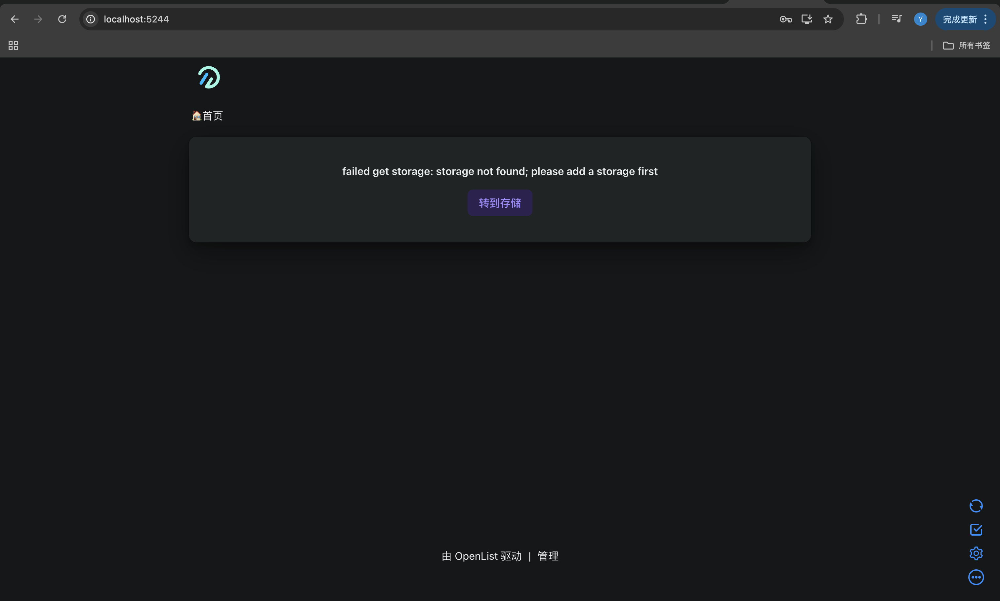
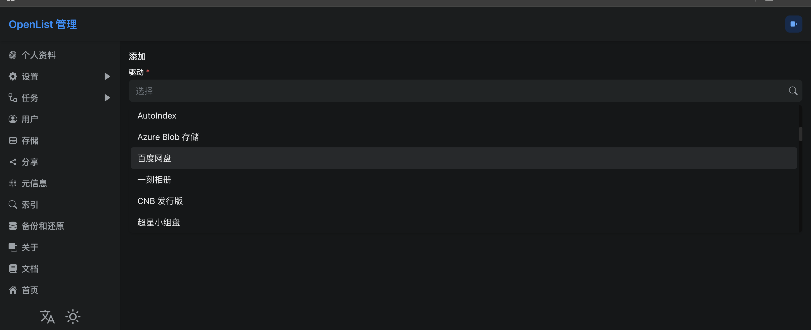
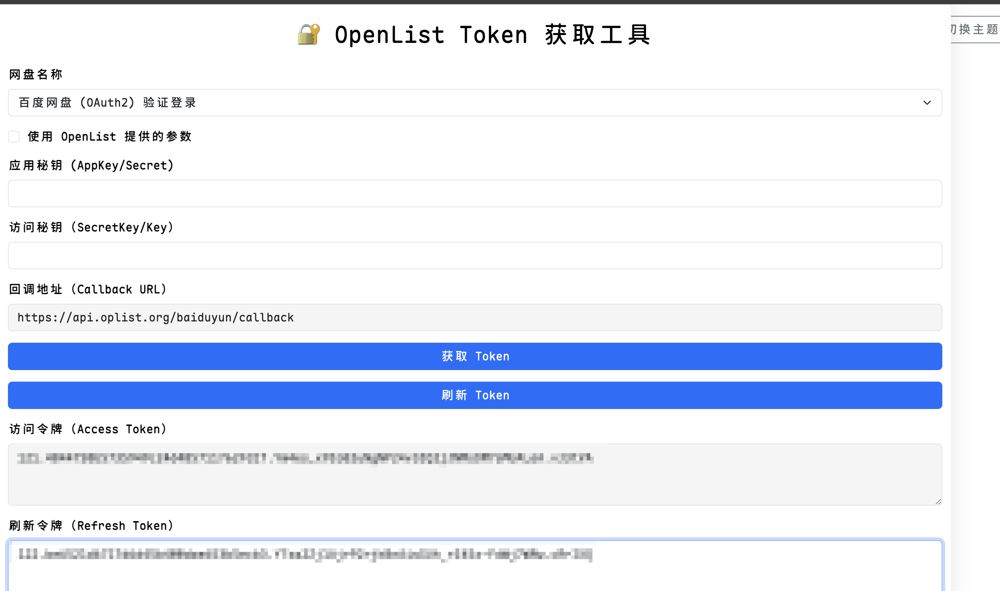
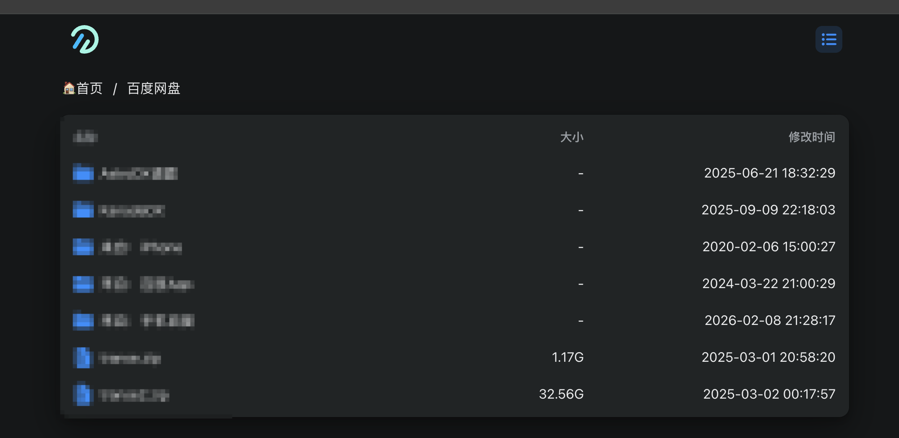
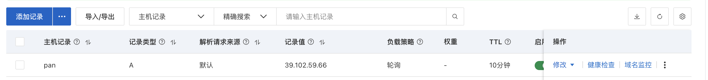
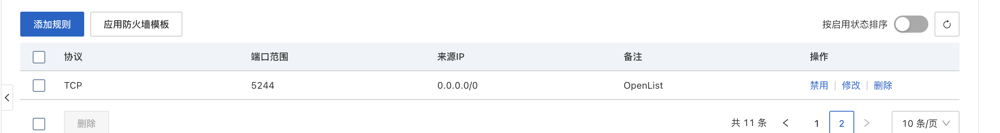
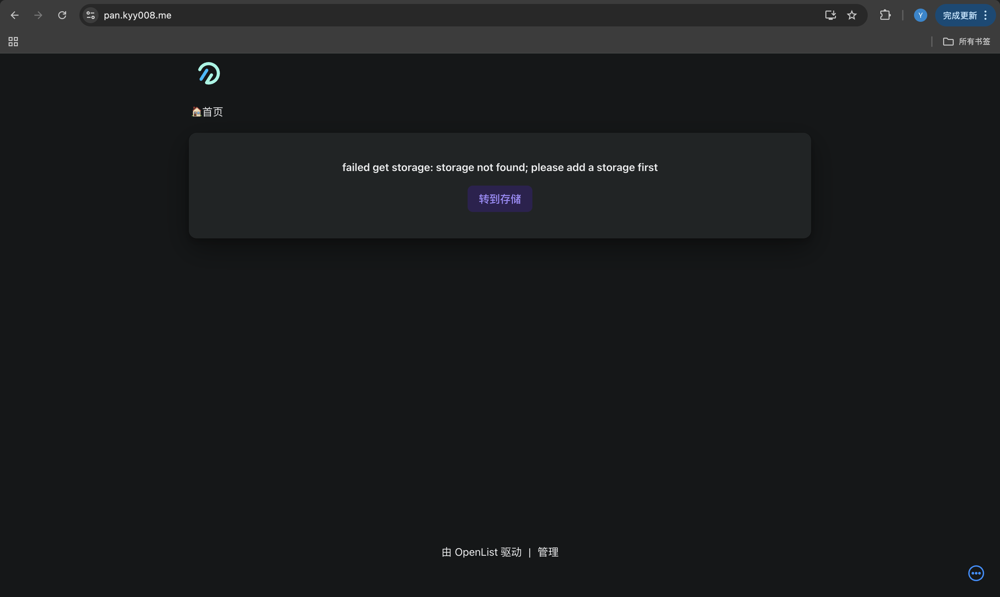
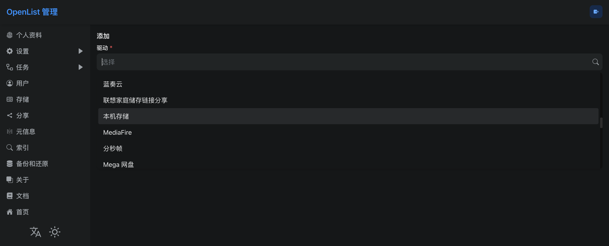
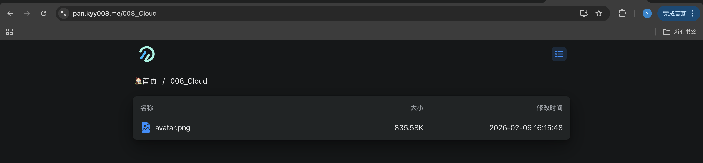
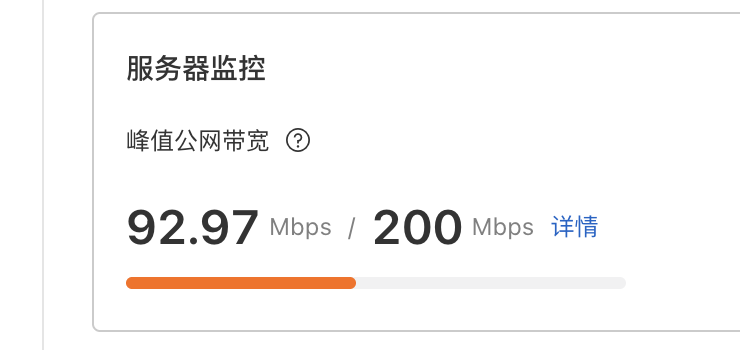

既然购入了云服务器，Kyy008 就要想办法搞点新东西出来。

Kyy008 没有选择使用 NAS 来搭建自己的云盘：不仅价格较为昂贵，而且仔细想想后发现没什么太大使用需求（~~毕竟已经购入了百度网盘的年 VIP~~）。

后来想想不如直接挂载一个我云服务器的文件夹作为一个迷你网盘，一是本人购买的轻量级应用服务器有着`200Mbps`的峰值公网带宽，服务器出口速度非常快，适合下载任务；二是也可以满足本人“便捷地通过个人域名一键下载上传小型文件”的使用场景。除了仅有约 20G 存储空间留给网盘的限制外，没有任何额外附加成本。

# OpenList 网盘聚合器
## AList 已死

AList 原本是最大的开源网盘挂载工具，却于 25 年中旬在没有声明的情况下将所有权出售给商业公司，与开源精神的初衷背道而驰；更有甚者，在被收购后的版本中，在 Docker 镜像和源码中被发现了未经用户同意、默认开启的数据上报代码，用户隐私形同虚设。因此寻找能平替 AList 的工具是最好选择。

::github{repo="AlistGo/alist"}

OpenList 则是从 AList 仓库 Fork 出的一个项目，剔除商业公司的代码和遥测机制，同时保留了 AList 原本的功能，十分容易上手且保障安全性。

::github{repo="OpenListTeam/OpenList"}

# 本地上手体验

docker 部署 OpenList
```bash
docker run -d --restart=always \
  -v ~/openlist-data:/opt/openlist/data \
  -p 5244:5244 \
  -e PUID=$(id -u) -e PGID=$(id -g) \
  -e UMASK=022 \
  --name="openlist" \
  openlistteam/openlist:latest
```
修改管理员密码
```bash
docker exec -it openlist ./openlist admin set 你自己的密码
```
访问`http://localhost:5244`，用户名是`admin`，密码是你刚刚设定的，就可以看到 OpenList 首页了
我们以百度网盘为例，看看聚合网盘的效果。

点击首页的`转到存储`，添加一个驱动，选择百度网盘

下面说明表单中有必要填写的值，其余保持默认即可
- 挂载路径：命名随意，区分你挂载的各个网盘，但务必以`/`开头。这里我填写`/百度网盘`
- 网页代理：勾选
- WebDAV 策略：302 重定向
- **刷新令牌**：
	- 访问`https://api.oplist.org/`
	- 网盘名称勾选`百度网盘验证登录`
	- 勾选`使用 OpenList 提供的参数`
	- 点击`获取 Token`，授权一下
	- 复制生成的`刷新令牌`到这里即可
	
最后点击页面底部的 **`添加`** 按钮即可，我们返回首页就可以直接查看百度网盘中的内容了。我们还可以直接在这里进行查看、上传、下载操作。

# 云端部署并挂载本地文件夹
在云服务器上部署 OpenList 并挂载一个文件夹作为网盘
### 镜像加速
配置一下国内的 Docker 加速镜像，否则 GFW 会阻断 Docker Hub 导致连接超时
```bash
sudo mkdir -p /etc/docker
sudo tee /etc/docker/daemon.json <<-'EOF'
{
    "registry-mirrors": [
        "https://docker.1ms.run",
        "https://docker-0.unsee.tech",
        "https://docker.m.daocloud.io"
    ],
    "live-restore": true,
    "features": {
        "buildkit": true
    }
}
EOF
```
重启一下
```bash
sudo systemctl daemon-reload
sudo systemctl restart docker
```
### 准备文件夹
新建一个文件夹，保存我们的配置文件和数据文件
```bash
mkdir ~/pan
cd ~/pan
mkdir data
mkdir config
```
允许文件夹内所有文件可读可写
```bash
sudo chmod -R 777 ~/pan/config ~/pan/data
```
### 域名解析和端口开放
准备一个子域名

开启`5244` 端口，OpenList应用会占用这个端口

推荐开启 `https` 
```bash
sudo certbot --nginx -d 你的子域名
```
### Docker部署OpenList
启动容器，并把之前新建的`~/pan/data` 和`~/pan/config`分别映射到容器的数据和配置文件夹
```bash
docker run -d --restart=always \
  -v /home/kyy008/pan/config:/opt/openlist/data \
  -v /home/kyy008/pan/data:/mnt/local_data \
  -p 5244:5244 \
  -e PUID=0 -e PGID=0 \
  -e UMASK=022 \
  --name="openlist" \
  openlistteam/openlist:latest
```
设置管理员密码
```bash
docker exec -it openlist ./openlist admin set 你设置的密码
```
### Nginx 反向代理
将`ip:5244` 映射到我们的子域名，首先创建配置文件
```bash
nano /etc/nginx/conf.d/pan.conf
```
粘贴下面内容，注意替换为你的域名
```nginx
server {
    listen 80;
    server_name 你的子域名;

    location / {
        proxy_set_header X-Forwarded-For $proxy_add_x_forwarded_for;
        proxy_set_header X-Forwarded-Proto $scheme;
        proxy_set_header Host $http_host;
        proxy_set_header X-Real-IP $remote_addr;
        proxy_set_header Range $http_range;
        proxy_set_header If-Range $http_if_range;
        proxy_redirect off;
        proxy_pass http://127.0.0.1:5244;

        client_max_body_size 0;
    }
}
```
现在浏览器访问你的域名，用户名`admin`，密码是刚刚设置的，就能看到 OpenList 首页了

## 在 OpenList 后台挂载本地存储
点击`转到存储`，点击`添加`，我们驱动选择`本地存储`

下面说明表单中有必要填写的值，其余保持默认即可
- 挂载路径：命名随意，区分你挂载的各个网盘，但务必以`/`开头。
- 根文件夹路径：填写`/mnt/local_data`
:::important
根文件夹路径不要填写`~/pan/data`
:::
点击`添加`按钮，你就挂载好了本地文件夹了。现在你可以通过界面自由地添加或下载文件了～

十分可观的服务器出口速度，一秒可以下载1GB+大小文件
