# 前言
令人感慨的是，本篇 Blog 是 Kyy008 第一次系统地使用 Markdown 语法书写的文章。如果你好奇前两篇文章是如何编写的，那么 Kyy008 会说 AI 太好用了（
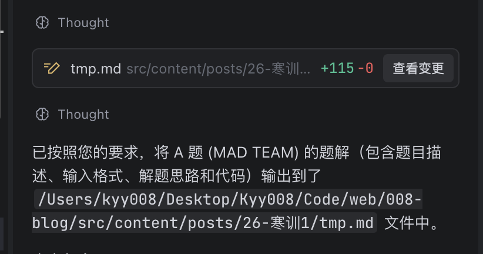
虽然 AI 生成极大的降低了上手难度，毕竟你不需要了解任何 .md 语法，但是它终究不是长久之道，许多内容仍然需要我们手动添加，~~而且AI生成的内容十分愚蠢~~。于是我找到了一个功能强大、易于上手的 Markdown 编辑器 Obsidian，可以使编写文章的效率大提升。

# 下载
点击[obsidian的官方下载网站](https://obsidian.md/download)，选择你对应的系统下载即可。软件支持简体中文。
# 初次使用
初次进入软件后出现如下界面
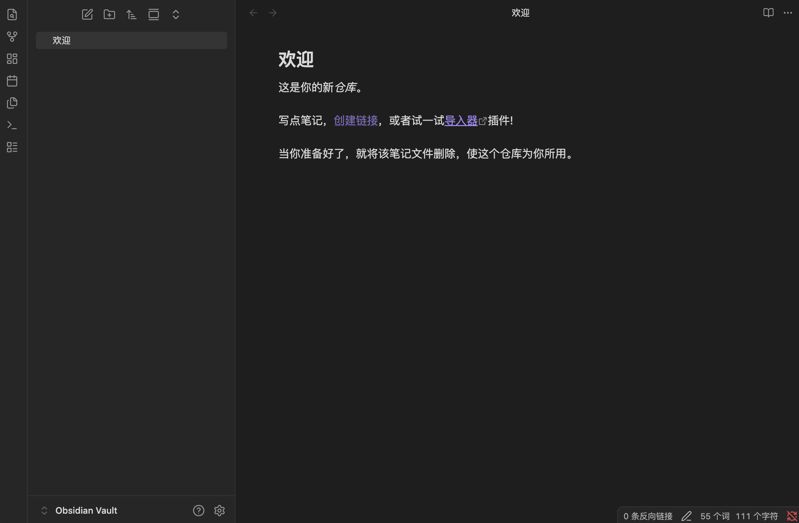
我们点击左下角的 `Obsidian Vault`，选择管理仓库
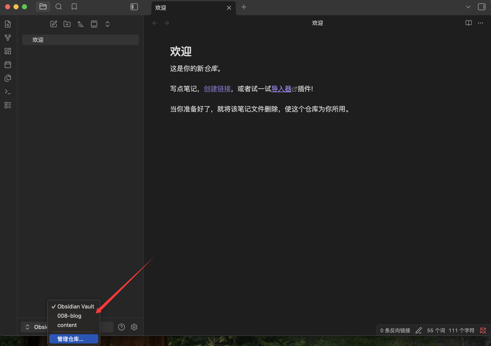
这里根据自己的个人需求选择。**之后的说明场景都以编写一个 Blog 文章为例**。我们选择打开本地仓库。
:::important
请注意，Obsidian会自动在我们所选择的仓库下生成 `.Obsidian` 配置文件夹，因此一旦确定选择某个仓库编写自己 Blog 的文章后，最好不要再随意修改。
:::
如何确定打开哪个仓库呢？建议找到**包含你所有要编辑文章所需文件的父文件夹**作为 Blog 编辑仓库。以本站为例，需要在`post`文件夹编写文章、在`spec`文件夹编写特殊 Markdown文件，于是便选择它们的父文件夹`content` 作为工作仓库。可以看到这里生成了`.obsidian` 文件夹。**如果你使用了远程仓库管理项目**，请注意将下面的代码添加到你的`.gitignore` 文件里
```bash
.obsidian/
```

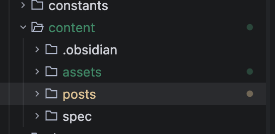
上述操作完成后，在父文件夹`/content` 下建一个`\assets\image` 文件夹，这个我们在后续的配置中会提到
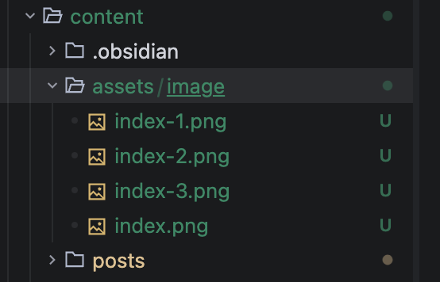

# 配置

为了让 Obsidian 里的文章和图片都能正确地发布到博客上，这里有必要说明软件的两个坑点。

1.  Obsidian 默认使用一种双中括号的链接格式（例如 `[[image.png]]`），这被称为 Wiki Link，仅在 Obsidian 内可见。由于不是通用的 Markdown语法，导致大多数博客程序无法识别。
2.  Obsidian 对图片默认是**带空格的链接** 。例如图片名叫 `my pic.png`，Obsidian 生成的链接是 ``。大多博客解析器只会读到空格后结束了，导致找不到图片。并且 Markdown强制使用相对路径引用图片，管理较为繁琐

对于第一个问题，我们只需要简单调整一下设置即可。首先我们点开左下角的设置按钮
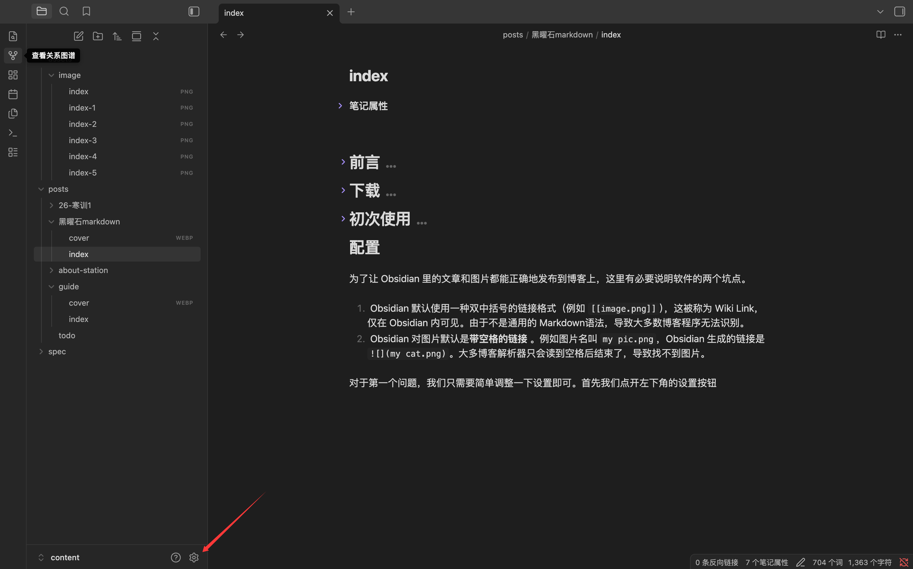
点击 **文本与链接** 选项，将 `使用 Wiki 链接` 选项关闭，Obsidian即可自动生成通用图片语法`` 。与此同时，我们将**附件默认存放路径** 选项改为`指定的附件文件夹`, 附件文件夹路径填写我们上一步创建的`\assets\image`文件夹
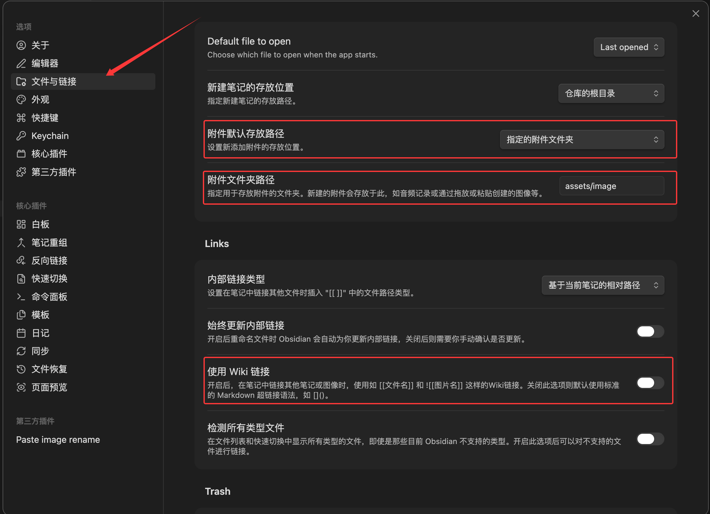对于第二个问题，我们可以下载一个第三方插件来解决。首先打开设置并关闭安全模式
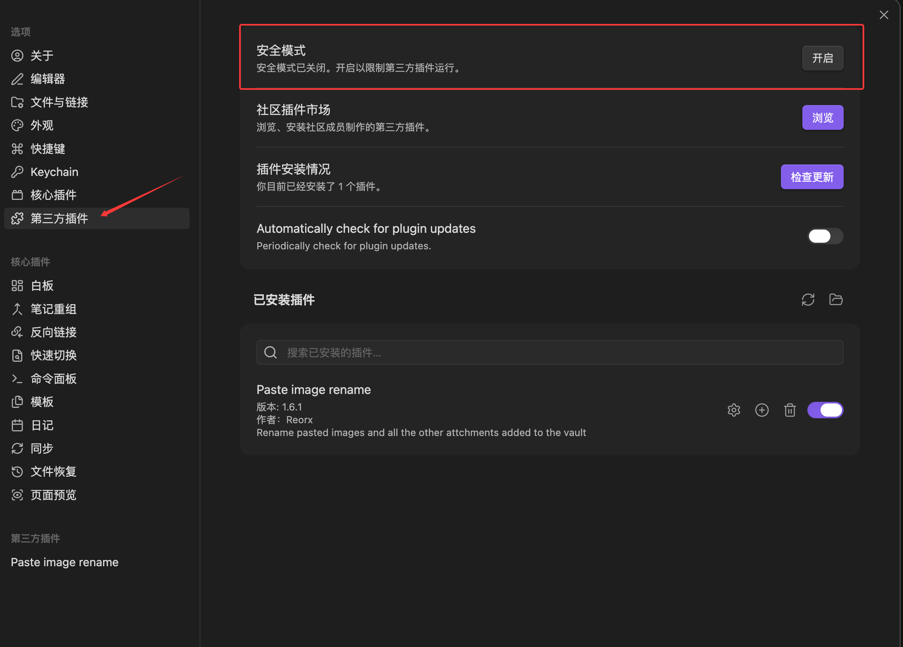
进入**社区插件市场**，搜索`Paste image rename`，点击安装并选择启用
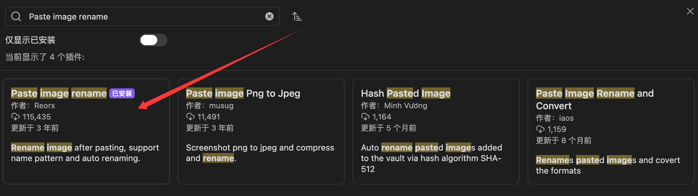
接下来我们回到设置界面，可以看到我们从插件市场安装的第三方插件也可以进行相关的配置。我们点进这个插件，将 **Auto rename** 选项打开。
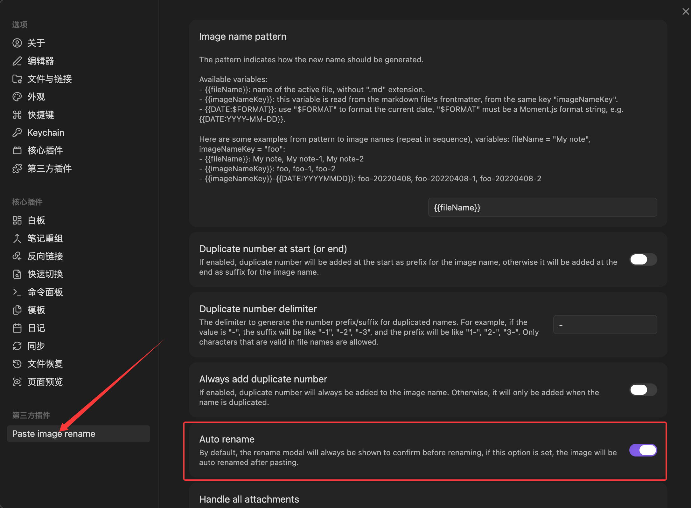
进行完上述配置后，Obsidian 在 .md 中插入图片就变得极其简单：
:::important
只需要复制我们想插入的图片（或者使用QQ截图到剪切板）后粘贴到 .md 文件，图片会自动按规范格式放置到 /assets/image下，并在 .md 中自动插入它的相对路径。一键部署，完全不需要你具备任何文件管理与相对路径的知识！
:::

# Obsidian的其它优势
### 用户友好的 .md 编辑显示
就算是在编辑模式下，obsidian 也可以提供渲染好的 .md 效果供我们参考查看，摒弃晦涩难懂的纯代码编辑模式。
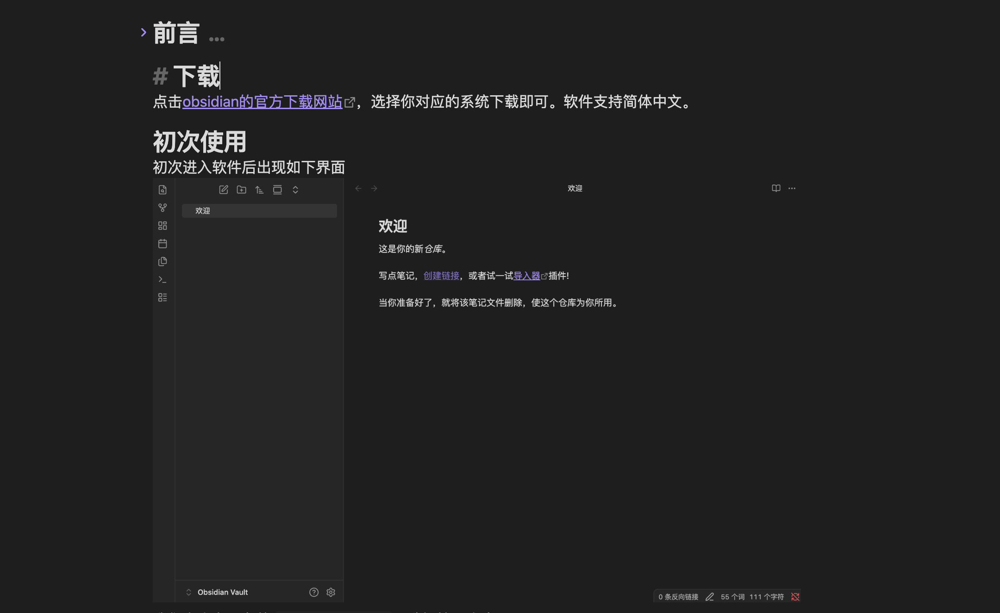
### 文章属性一键修改
我们在写文章时都要在文章头配置属性，Obsidian 支持通过点点点的操作，而非代码编辑模式下，快速编辑我们想要的属性，包括但不限于一键删除 or 添加 tag值、勾选 bool 属性框等，**甚至还可以记录历史 tag、description 等属性一键添加**。
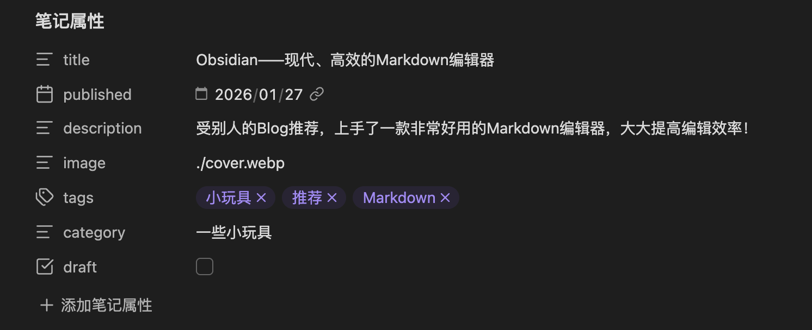
### 不熟悉语法？内部集成！
十分用户友好的功能。如果你正为不熟悉 Markdown 的常用语法而发愁，例如：

**文本加粗**、~~删除线~~、*文本倾斜*、
```
代码块
```
1. 有序列表

等等，你可以**直接选择文本后右键**，选择你想要的文本效果就可以了！
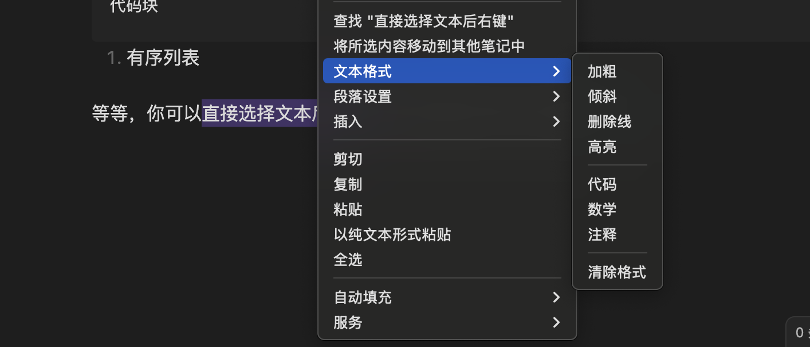至此，如果我们只是想要通过 Post 文章运维我们的 Blog，只需要在 Obsidian 中打开我们的仓库并撰写 .md 文档就可以了，完全不需要启动 ide～